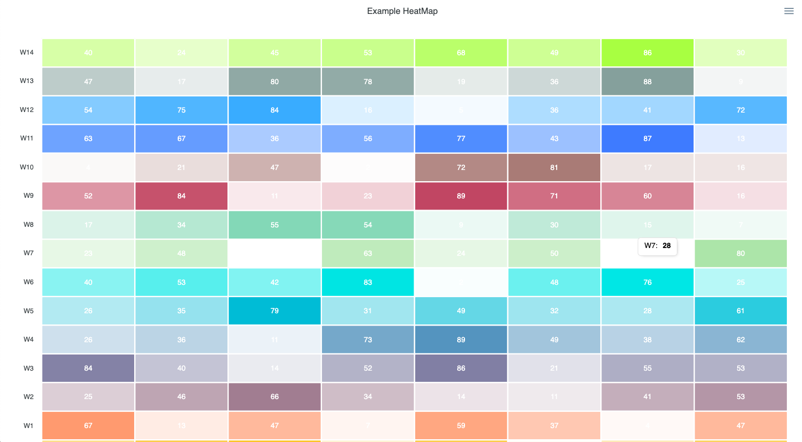
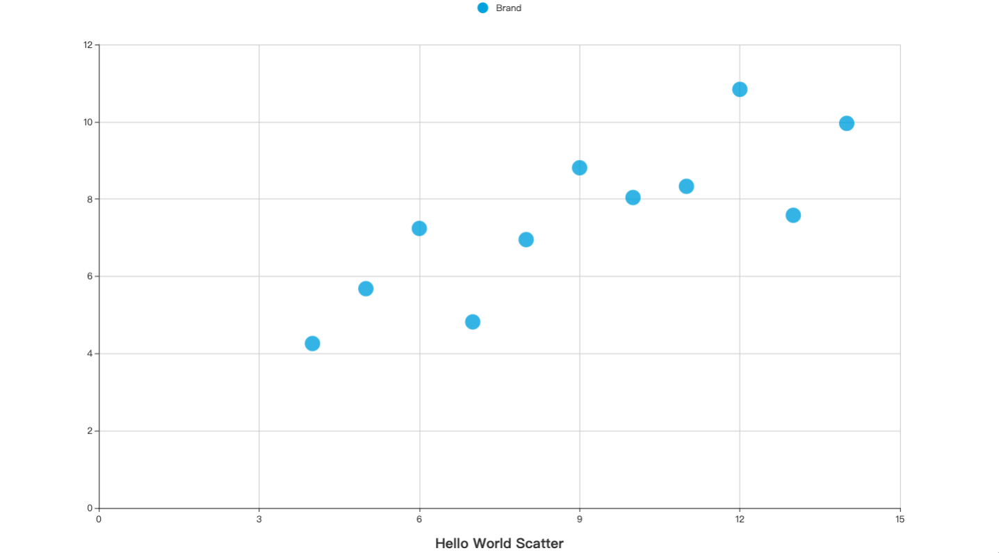
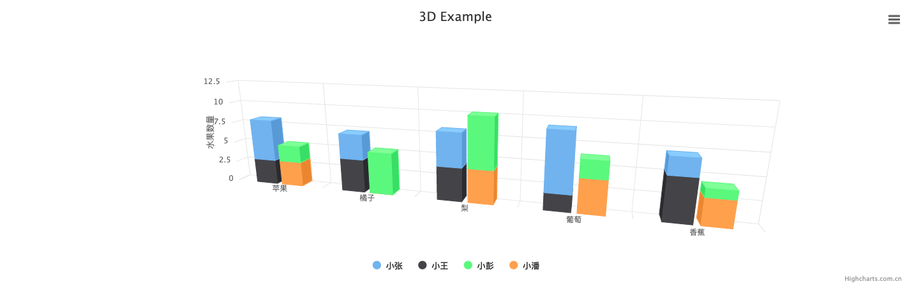

# chart

> 图表库的开发


#### 1. 原生模版引擎的使用：template

```text
cd chapter5 && go run main.go
>>
2019/12/04 19:04:17 originMethod:
<body>
<div class= "test-class"></div>
<h1> test-title</h1>
<p>test-content</p>
</body>2019/12/04 19:04:17
2019/12/04 19:04:17 withPackr:
<body>
<div class= "test-class"></div>
<h1> test-title</h1>
<p>test-content</p>
</body>
```

#### 2. Apexcharts 实现图表最小系统：Apexcharts

```text
cd chapter5/Apexcharts && go test *.go

>> 访问 http://127.0.0.1:7878

```



#### 3. BizCharts 实现图表最小系统：BizCharts

```text
cd chapter5/BizCharts && go test *.go

>> 访问 http://127.0.0.1:9999

```


### 4. Echarts 实现图表最小系统：Echarts

```text
cd chapter5/Echarts && go test *.go

>> 访问 http://127.0.0.1:9998
```


#### 5. HighCharts 实现图表最小系统

```text
cd chapter5/HighCharts && go test *.go

>> 访问 http://127.0.0.1:7777
```
